# edu-admin-pro

> 基于 Vue 3 + Vite + TypeScript 的教务数据可视化管理系统，覆盖学生/教师/课程/成绩/选课/排课/评教/审计全业务流程，可作为高校教务系统前端重构的标准工程基座。

<p align="center">
  
  
  
  
  
  
</p>

<p align="center">
  <a href="#-功能特性">功能特性</a> •
  <a href="#-项目架构">项目架构</a> •
  <a href="#-快速开始">快速开始</a> •
  <a href="#-项目结构">项目结构</a> •
  <a href="#-角色与权限">角色与权限</a> •
  <a href="#-后端对接">后端对接</a>
</p>

---

## ✨ 功能特性

### Phase 1 — 基础架构
- **JWT 登录认证**：Mock 多角色登录（admin / teacher / student），Token 持久化存储
- **RBAC 权限控制**：菜单级权限过滤 + 按钮级 `v-permission` 指令
- **动态侧边栏菜单**：根据角色自动渲染可用菜单项
- **字典管理**：学院/专业/年级/性别/课程类型/学期等数据字典
- **响应式布局**：侧边栏折叠、面包屑导航、顶部用户信息下拉

### Phase 2 — 核心业务
- **学生管理**：CRUD 完整操作，删除撤销回溯机制（8 秒内可恢复），性别/专业分布图表
- **教师管理**：教师信息维护，与课程绑定
- **课程管理**：课程 CRUD，绑定授课教师与开课学院，课程类型标签化展示
- **成绩管理**：成绩录入/编辑/删除，权重配置（平时/期中/期末），自动计算总评与 GPA，成绩分布柱状图 + 绩点饼图

### Phase 3 — 高级业务
- **学生选课**：可选课程列表（容量进度条）、学分上限控制（30 学分）、一键选课/退课、已选课程管理
- **排课管理**：教室/时间段/周次安排，自动冲突检测（教室冲突 + 教师冲突）
- **学生评教**：五维评分（教学态度/内容/方法/互动/效果），参评率统计，学生留言精选

### Phase 4 — 运维运营
- **操作审计日志**：记录用户操作行为，支持按操作人/模块/状态筛选
- **Excel 导入导出**：学生/课程/成绩数据一键导出 `.xlsx`，支持 Excel 批量导入
- **数据可视化大屏**：首页 Dashboard 集成 KPI 卡片 + 院系分布 + 性别比例 + 成绩分布 + 课程类型占比 + 招生趋势

---

## 🏗️ 项目架构

```mermaid
flowchart TB
    subgraph User["用户层"]
        A1["管理员 admin/admin123"]
        A2["教师 teacher/teacher123"]
        A3["学生 student/student123"]
    end

    subgraph View["视图层 (Views)"]
        V1["HomeView<br/>Dashboard 仪表盘"]
        V2["StudentView<br/>学生 CRUD + 图表"]
        V3["TeacherView<br/>教师管理"]
        V4["CourseView<br/>课程管理"]
        V5["ScoreView<br/>成绩 + 权重 + 图表"]
        V6["CourseSelectView<br/>学生选课"]
        V7["ScheduleView<br/>排课 + 冲突检测"]
        V8["EvaluationView<br/>评教结果"]
        V9["OperationLogView<br/>审计日志"]
        V10["LoginView<br/>登录页"]
    end

    subgraph Component["组件层 (Components)"]
        C1["AppLayout<br/>侧边栏 + Header + 路由容器"]
        C2["ChartPanel<br/>ECharts 声明式封装"]
        C3["DataCard<br/>KPI 统计卡片"]
        C4["Breadcrumb<br/>面包屑"]
        C5["StudentFormDialog<br/>表单对话框"]
    end

    subgraph Store["状态层 (Pinia Stores)"]
        S1["user.ts<br/>登录/权限/菜单检查"]
        S2["student.ts<br/>学生数据"]
        S3["teacher.ts<br/>教师数据"]
        S4["course.ts<br/>课程数据"]
        S5["score.ts<br/>成绩 + 权重 + 统计"]
        S6["courseSelect.ts<br/>选课记录"]
        S7["log.ts<br/>审计日志"]
        S8["dict.ts<br/>数据字典"]
    end

    subgraph Utils["工具层"]
        U1["auth.ts<br/>Token 读写"]
        U2["permission.ts<br/>RBAC 配置"]
        U3["export.ts<br/>Excel 导入导出 (xlsx)"]
        U4["request.ts<br/>Axios 实例 + 拦截器"]
    end

    subgraph Router["路由层"]
        R1["Vue Router 4<br/>Hash 模式 + 路由守卫"]
    end

    A1 --> V1 & V2 & V3 & V4 & V5 & V6 & V7 & V8 & V9
    A2 --> V1 & V2 & V3 & V4 & V5 & V8
    A3 --> V1 & V4 & V5 & V6 & V8

    V1 & V2 & V3 & V4 & V5 & V6 & V7 & V8 & V9 --> C1
    V1 & V2 & V5 --> C2
    V1 --> C3
    C1 --> C4
    V2 --> C5

    V2 --> S2
    V3 --> S3
    V4 --> S4
    V5 --> S5
    V6 --> S6
    V8 --> S4
    V9 --> S7
    V2 & V3 & V4 & V5 & V6 & V7 & V8 --> S1

    S1 --> U1 & U2
    V2 & V4 & V5 --> U3
    S2 & S3 & S4 & S5 --> U4

    R1 --> V1 & V2 & V3 & V4 & V5 & V6 & V7 & V8 & V9 & V10
    R1 --> S1
```



---

## 🚀 快速开始

### 环境要求
- Node.js >= 18.0.0
- pnpm >= 8.0.0（推荐）

### 安装依赖
```bash
git clone https://github.com/juice094/edu-admin-pro.git
cd edu-admin-pro
pnpm install
```

### 开发调试
```bash
pnpm dev
```
浏览器访问 `http://localhost:5173`

### 生产构建
```bash
pnpm build
```
构建产物输出至 `dist/` 目录。

### 代码检查
```bash
pnpm lint      # ESLint 检查并自动修复
pnpm format    # Prettier 格式化
```

---

## 📁 项目结构

```
edu-admin-pro/
├── public/                          # 静态资源
├── src/
│   ├── api/                         # HTTP 请求层
│   │   ├── modules/                 # 按业务域拆分
│   │   │   └── student.ts
│   │   └── request.ts               # Axios 实例 + 拦截器
│   ├── components/                  # 通用组件
│   │   ├── AppLayout.vue            # 主布局（侧边栏 + Header + RouterView）
│   │   ├── AppHeader.vue            # 顶部栏
│   │   ├── Breadcrumb.vue           # 面包屑导航
│   │   ├── ChartPanel.vue           # ECharts 声明式封装（vue-echarts）
│   │   ├── DataCard.vue             # KPI 数据卡片
│   │   └── StudentFormDialog.vue    # 学生表单对话框（新增/编辑共用）
│   ├── composables/                 # 组合式逻辑复用
│   │   └── useChart.ts              # ECharts 生命周期封装
│   ├── directives/                  # 自定义指令
│   │   └── permission.ts            # v-permission 按钮权限指令
│   ├── router/                      # 路由配置
│   │   └── index.ts                 # Vue Router 4，Hash 模式，路由守卫
│   ├── stores/                      # Pinia 状态管理
│   │   ├── index.ts                 # 应用级状态（主题、布局）
│   │   ├── user.ts                  # 用户登录/权限/角色
│   │   ├── student.ts               # 学生数据
│   │   ├── teacher.ts               # 教师数据
│   │   ├── course.ts                # 课程数据
│   │   ├── score.ts                 # 成绩 + 权重 + 统计
│   │   ├── courseSelect.ts          # 选课记录
│   │   ├── log.ts                   # 审计日志
│   │   └── dict.ts                  # 数据字典
│   ├── styles/                      # 全局样式
│   │   ├── variables.scss           # SCSS 变量
│   │   └── index.scss               # 全局重置
│   ├── types/                       # TypeScript 类型定义
│   │   ├── index.ts
│   │   ├── user.ts
│   │   ├── course.ts
│   │   ├── score.ts
│   │   └── teacher.ts
│   ├── utils/                       # 工具函数
│   │   ├── auth.ts                  # Token 读写
│   │   ├── permission.ts            # RBAC 权限配置
│   │   ├── export.ts                # Excel 导入导出（xlsx）
│   │   └── format.ts                # 格式化工具
│   ├── views/                       # 页面级组件
│   │   ├── LoginView.vue            # 登录页
│   │   ├── HomeView.vue             # 首页 Dashboard（KPI + 5 图表）
│   │   ├── StudentView.vue          # 学生管理（CRUD + 图表 + 导入导出）
│   │   ├── TeacherView.vue          # 教师管理
│   │   ├── CourseView.vue           # 课程管理（导入导出）
│   │   ├── ScoreView.vue            # 成绩管理（权重 + 图表 + 导出）
│   │   ├── CourseSelectView.vue     # 学生选课
│   │   ├── ScheduleView.vue         # 排课管理（冲突检测）
│   │   ├── EvaluationView.vue       # 评教结果
│   │   ├── OperationLogView.vue     # 审计日志
│   │   └── AboutView.vue            # 关于系统
│   ├── App.vue                      # 根组件
│   └── main.ts                      # 应用入口（ECharts 渲染器注册 + 全局图标）
├── .vscode/                         # VS Code 推荐配置
├── env.d.ts
├── eslint.config.mjs
├── prettier.config.mjs
├── vite.config.ts                   # Vite 配置（别名 / 代理 / 手动分块）
└── package.json
```

---

## 🔐 角色与权限

| 角色 | 账号 / 密码 | 可访问菜单 |
|------|------------|-----------|
| 管理员 | admin / admin123 | 首页、学生、教师、课程、成绩、选课、排课、评教、日志、关于 |
| 教师 | teacher / teacher123 | 首页、学生、教师、课程、成绩、评教、关于 |
| 学生 | student / student123 | 首页、课程、成绩、选课、评教、关于 |

### 按钮级权限码
- `student:add` / `student:edit` / `student:delete`
- `teacher:add` / `teacher:edit` / `teacher:delete`
- `course:add` / `course:edit` / `course:delete`
- `score:enter` / `score:audit`
- `schedule:manage`
- `log:view`

---

## 🔌 后端对接

### 1. 配置代理

修改 `vite.config.ts` 中的 `server.proxy`：

```typescript
server: {
  proxy: {
    '/api': {
      target: 'http://localhost:8080',
      changeOrigin: true,
      rewrite: (path) => path.replace(/^\/api/, '')
    }
  }
}
```

### 2. 修改接口地址

生产环境在 `request.ts` 中配置 `baseURL`：

```typescript
const request = axios.create({
  baseURL: import.meta.env.VITE_API_BASE_URL || '/api',
  timeout: 10000
})
```

### 3. 从 Mock 切换到真实 API

当前所有 CRUD 操作使用 Pinia Store + Mock 数据。接入真实后端后：

1. 在 `src/api/modules/` 下新建业务接口文件
2. 在对应的 Store 中替换 Mock 数据逻辑为真实 API 调用
3. 视图层保持绑定 Store，**无需改动模板代码**

---

## 🏗️ 工程化亮点

### 构建优化
- **Vite 6**：冷启动 < 300ms，HMR 毫秒级响应
- **Rollup 手动分块**：`vue-vendor` / `ui-vendor` / `echarts-vendor` / `export` 独立 chunk，长期缓存更稳定
- **ESNext 目标**：现代浏览器原生支持，减少 polyfill 体积

### 类型安全
- **TypeScript 5.7**：全链路类型约束，接口 / Props / Store / 路由元信息强类型
- **vue-tsc**：构建前类型检查，杜绝运行时类型错误

### 图表方案
- **ECharts 5 按需引入**：仅注册 `CanvasRenderer` + 用到的图表类型，体积减少 60%+
- **vue-echarts**：声明式组件封装，自动处理 init / resize / dispose 生命周期
- **响应式同步**：数据变化自动更新图表，无需手动调用 `setOption`

### 代码规范
- **ESLint 9 Flat Config**：一体化配置，无 `.eslintrc` 冗余文件
- **Prettier**：统一代码风格，保存自动格式化

---

## 📄 开源协议

[MIT](LICENSE) © 2025 juice094
